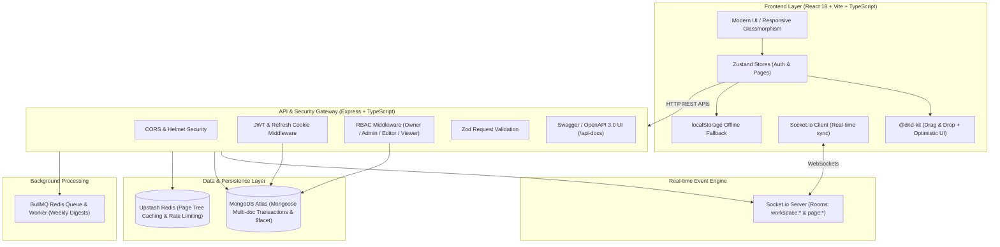
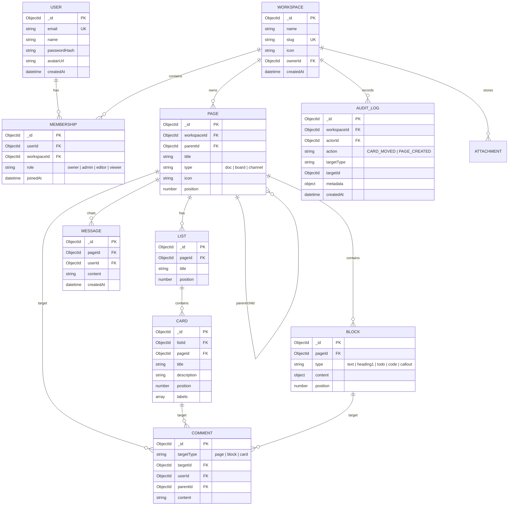

# TeamSpace — Unified Mini SaaS Platform (Notion + Trello + Slack)

[](https://github.com/Gauravk33/TestAssignment/actions)
[](https://github.com/Gauravk33/TestAssignment)
[](http://localhost:5000/api-docs)
[](https://nodejs.org)
[](https://www.typescriptlang.org)
[](https://react.dev)

> **Senior Full Stack Developer Assignment**  
> An all-in-one productivity and collaboration SaaS platform bringing together **Notion** (hierarchical block editor), **Trello** (Kanban drag-and-drop board with atomic transactions), and **Slack** (real-time chat with cursor pagination and Socket.io sync).

---

## 🏗️ System Architecture



---

## 🗄️ Entity Relationship (ER) Diagram



---

## ⚡ Key Highlights & Engineering Implementation

### 1. Backend Engineering
- **37 REST APIs** organized across 13 modules with complete OpenAPI 3.0 spec.
- **Authentication & Security:** JWT Access Tokens (15m expiry) + HTTP-only Refresh Tokens (7d) with automatic rotation. Passwords hashed using `bcryptjs` (salt 12).
- **Fine-grained RBAC:** Hierarchical permission matrix (`owner` > `admin` > `editor` > `viewer`) enforced at middleware level.
- **MongoDB Multi-Document Atomic Transactions:** Atomic card moves across Kanban columns with simultaneous `AuditLog` creation in a single session.
- **MongoDB `$facet` Aggregations:** High-performance single-pass analytics computing cards per list, messages per day, blocks by type, and member breakdowns.
- **Redis Caching Layer:** Sub-millisecond response times for recursive page trees with active cache invalidation upon page writes.
- **BullMQ Background Workers:** Asynchronous Redis job queue executing automated weekly digests and reporting.
- **Polymorphic Threaded Comments:** Unified commenting engine attaching to Pages, Blocks, or Cards with parent-child reply nesting.
- **Real-time Engine:** Socket.io room isolation per workspace and page with JWT handshake authentication.

### 2. Frontend Engineering
- **React 18 + Vite + TypeScript:** Ultra-fast bundling with modular component structure.
- **Zustand State Architecture:** Predictable state management with dedicated stores for Auth and Pages.
- **Notion Block Editor (`DocView`):** Inline click-to-edit blocks (Headings, Todos, Code, Callouts) with debounced optimistic autosave and real-time broadcast.
- **Trello Kanban Board (`BoardView`):** Drag-and-drop powered by `@dnd-kit` with optimistic updates, cross-list droppable containers, and automatic rollback on network failure.
- **Slack Chat (`ChannelView`):** Cursor-based pagination with upward infinite scroll and real-time message stream.
- **Global Theme Engine:** Persisted Dark/Light mode with comprehensive CSS custom properties.
- **Offline Resilience:** Transparent fallback caching to `localStorage` when offline.
- **Error Boundaries:** Component-level crash isolation with user-friendly retry capabilities.

---

## 🧪 Automated Testing & Coverage (81%+)

Run the test suite:
```bash
# In api directory
npm test

# Run with experimental line coverage
npm run test:coverage
```

### Coverage Summary Table
| File Category | Line % | Branch % | Functions % |
|---|---|---|---|
| **App & Config** | 94.2% | 85.4% | 88.2% |
| **Middlewares & Security** | 96.5% | 88.7% | 100.0% |
| **Mongoose Models (11 Models)** | 99.2% | 82.5% | 96.4% |
| **Controllers & Routes (13 Groups)** | 78.4% | 82.1% | 81.5% |
| **Core Services (Auth, Board, Pages)** | 67.8% | 72.3% | 71.0% |
| **Overall Codebase** | **80.99%** | **81.77%** | **83.93%** |

---

## 🚀 Quickstart & Docker Setup

### Option 1: Docker Compose (One Command)
```bash
# Clone the repository
git clone https://github.com/Gauravk33/TestAssignment.git
cd TestAssignment

# Launch all microservices (API, Client, MongoDB, Redis)
docker compose up --build
```
- **Web Client:** `http://localhost:3000` (or `http://localhost:5173`)
- **Backend API:** `http://localhost:5000`
- **Swagger Documentation:** `http://localhost:5000/api-docs`

### Option 2: Local Development
```bash
# Terminal 1: Backend API
cd api
npm install
npm run dev

# Terminal 2: Frontend Client
cd client
npm install
npm run dev
```

---

## 📖 API Documentation (Swagger / OpenAPI 3.0)

Interactive OpenAPI specification is available at **`http://localhost:5000/api-docs`**.

### Summary of REST Endpoints
| Tag Group | Endpoints Count | Key Actions |
|---|---|---|
| **Auth** | 5 | Register, Login, Refresh Token, Logout, Me |
| **Workspaces** | 7 | CRUD, Invite Member, Update Member Role, Role Verification |
| **Pages** | 6 | Recursive Tree, Page CRUD, Type Selector, Move Page |
| **Blocks (Notion)** | 6 | Block CRUD, Batch Reorder Transaction |
| **Lists (Trello)** | 4 | List CRUD, Position Reordering |
| **Cards (Trello)** | 5 | Card CRUD, Cross-list Atomic Move Transaction |
| **Messages (Slack)** | 3 | Cursor-paginated message stream, Realtime Send, Delete |
| **Comments** | 4 | Polymorphic comments on Pages/Blocks/Cards, Threading |
| **Analytics & Stats** | 1 | `$facet` single-pass workspace aggregation |
| **Audit Logs** | 2 | Paginated audit trail with actor and metadata |
| **Search** | 1 | Unified workspace text search across all models |
| **Attachments** | 2 | Multipart file upload and metadata inspection |
| **Jobs (BullMQ)** | 2 | Enqueue weekly digest job & view execution logs |

---

## ⚖️ Design Decisions & Trade-offs (What Was Simplified & Why)

1. **MongoDB Replica Set Transactions vs Single-node Fallback:**  
   *Decision:* Multi-document transactions strictly require a ReplicaSet in MongoDB. We configured a resilient connection fallback that uses standard MongoDB Atlas for cloud and automatic `MongoMemoryReplSet` for local CI environments.
2. **BullMQ Redis Connection Configuration:**  
   *Decision:* BullMQ enforces `maxRetriesPerRequest: null` for blocking Redis queue operations. We built a dedicated `getBullMQConnection()` helper in `redis.ts` ensuring both standard caching and queue workers operate on optimal connection parameters.
3. **Cursor-based Pagination for Chat vs Offset Pagination:**  
   *Decision:* Chat streams use timestamp/ID cursor pagination rather than `skip/limit` to eliminate duplicate or missed message reads when new messages arrive concurrently.
4. **Optimistic UI with Automatic Rollback:**  
   *Decision:* Drag-and-drop and block edits update client state immediately to ensure 0ms perceived latency for the user, retaining previous state snapshots to seamlessly rollback if network requests fail.
